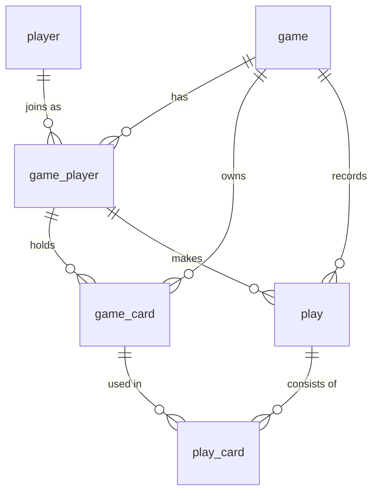

# Database Schema Plan

A plan for the tables needed to run the custom card game (see [AGENTS.md](../AGENTS.md)) as a **Discord application**, using Drizzle ORM on Cloudflare D1 (SQLite).

The design follows the conventions already in [src/db/schema.ts](../src/db/schema.ts): UUID text primary keys, `text` foreign keys, and integer epoch-millis timestamps.

---

## Overview

Seven tables cover the full lifecycle: who is playing, the game session, per‑game participation, the physical cards, and the sequence of plays.

---

## Tables

### 1. `player`

A Discord user. Persists across games so stats/history can be tracked.

| Column       | Type      | Notes                         |
| ------------ | --------- | ----------------------------- |
| `id`         | text (PK) | UUID                          |
| `discord_id` | text      | Discord snowflake, **unique** |
| `username`   | text      | Cached Discord display name   |
| `avatar_url` | text      | Discord profile image URL     |
| `created_at` | timestamp |                               |

---

### 2. `game`

A single game session, scoped to where it was launched in Discord. Only one game exists per channel at a time — launching a new game wipes the previous one and its rows. Deleting a `game` cascades to `game_player`, `game_card`, `play`, and `play_card` (`ON DELETE CASCADE`); the `game.current_turn_player_id` / `game.current_play_id` back-pointers use `ON DELETE SET NULL` to avoid a delete cycle.

| Column                   | Type                  | Notes                                                |
| ------------------------ | --------------------- | ---------------------------------------------------- |
| `id`                     | text (PK)             | UUID                                                 |
| `guild_id`               | text                  | Discord server (guild) snowflake                     |
| `channel_id`             | text                  | Discord channel snowflake, **unique**                |
| `current_round`          | integer               | Increments each new round                            |
| `current_turn_player_id` | fk → `game_player.id` | Whose turn it is (nullable)                          |
| `current_play_id`        | fk → `play.id`        | The active table play to beat (nullable = free play) |
| `created_at`             | timestamp             |                                                      |

---

### 3. `game_player`

Join table linking a `player` to a `game`, plus per‑game state (seat order, lockout, placement).

| Column          | Type             | Notes                                                   |
| --------------- | ---------------- | ------------------------------------------------------- |
| `id`            | text (PK)        | UUID                                                    |
| `game_id`       | fk → `game.id`   |                                                         |
| `player_id`     | fk → `player.id` |                                                         |
| `seat`          | integer          | Turn order position (0‑based, clockwise)                |
| `is_locked_out` | integer (bool)   | True if they passed this round                          |
| `placement`     | integer          | Finishing rank (1 = winner); nullable until they finish |
| `created_at`    | timestamp        |                                                         |

> Unique constraint on (`game_id`, `player_id`) and on (`game_id`, `seat`).

---

### 4. `game_card`

One row per physical card **per game** (52 rows when fully dealt). Tracks who holds it and whether it has been played. This is the source of truth for hands.

| Column           | Type                  | Notes                                              |
| ---------------- | --------------------- | -------------------------------------------------- |
| `id`             | text (PK)             | UUID                                               |
| `game_id`        | fk → `game.id`        |                                                    |
| `game_player_id` | fk → `game_player.id` | Current holder; `null` once played (i.e. on table) |
| `rank`           | text                  | `3`,`4`…`10`,`J`,`Q`,`K`,`A`,`2`                   |
| `suit`           | text                  | `diamonds` \| `clubs` \| `hearts` \| `spades`      |
| `created_at`     | timestamp             |                                                    |

> A card is in a player's hand while `game_player_id` is set, and has been played once it is `null` — so no separate status column is needed. Storing `rank`/`suit` as text keeps it readable; ordering for comparisons (per AGENTS.md) is handled in game logic via lookup maps.

---

### 5. `play`

A single turn action: either a played combination or a pass. Ordered by `created_at` to reconstruct game history.

| Column           | Type                  | Notes                                                                                            |
| ---------------- | --------------------- | ------------------------------------------------------------------------------------------------ |
| `id`             | text (PK)             | UUID                                                                                             |
| `game_id`        | fk → `game.id`        |                                                                                                  |
| `game_player_id` | fk → `game_player.id` | Who acted                                                                                        |
| `round`          | integer               | Round number this play belongs to                                                                |
| `type`           | text                  | `single` \| `pair` \| `straight` \| `flush` \| `full_house` \| `straight_flush` (null when pass) |
| `is_pass`        | integer (bool)        | True if the player passed                                                                        |
| `beats_play_id`  | fk → `play.id`        | The prior table play this one beat (nullable = opening play of a round)                          |
| `created_at`     | timestamp             |                                                                                                  |

---

### 6. `play_card`

Join table linking a `play` to the specific `game_card`s it used (1 card for a single, 5 for a straight, etc.).

| Column         | Type                | Notes |
| -------------- | ------------------- | ----- |
| `id`           | text (PK)           | UUID  |
| `play_id`      | fk → `play.id`      |       |
| `game_card_id` | fk → `game_card.id` |       |

> Unique constraint on `game_card_id` (a card can only be in one play).

---

## How the rules map to the schema

| Rule (AGENTS.md)                      | Supported by                                                                              |
| ------------------------------------- | ----------------------------------------------------------------------------------------- |
| Deal 52 cards evenly                  | `game_card` rows created & assigned `game_player_id` at deal time                         |
| Player holds a hand                   | `game_card` where `game_player_id` is set for a `game_player`                             |
| 3♦ holder goes first                  | Query `game_card` for rank `3` / suit `diamonds` to seed `current_turn_player_id`         |
| Valid hand types & "beating" a play   | `play.type` + `play_card` cards, validated in game logic; `beats_play_id` links the chain |
| Pass locks player out for the round   | `play.is_pass` + `game_player.is_locked_out`                                              |
| Round ends when all but one pass      | Count non‑locked `game_player`s per round; last successful `play` seeds next round        |
| Winner is first to empty hand         | No `game_card` left with their `game_player_id` → set `game_player.placement`             |
| Placement order for remaining players | `game_player.placement` (1..N)                                                            |

---

## Suggested indexes

- `player.discord_id` (unique) — lookup by Discord user.
- `game.channel_id` + `game.status` — find the active game in a channel.
- `game_card` on (`game_id`, `game_player_id`) — fetch a player's current hand fast.
- `play` on (`game_id`, `round`, `created_at`) — reconstruct round history in order.

---

## Notes / open decisions

- **Card ranks/suits as text vs. integer:** text is human‑readable; if comparison performance matters, add `rank_order` / `suit_order` integer columns to sort directly in SQL.
- **Spectators / max players:** add a `max_players` column on `game` if you want to cap lobby size.
- **Soft delete / history:** current design keeps full play history; nothing is hard‑deleted mid‑game.
- **Undo/redo:** the append‑only `play` + `play_card` log makes replay and audit straightforward.
