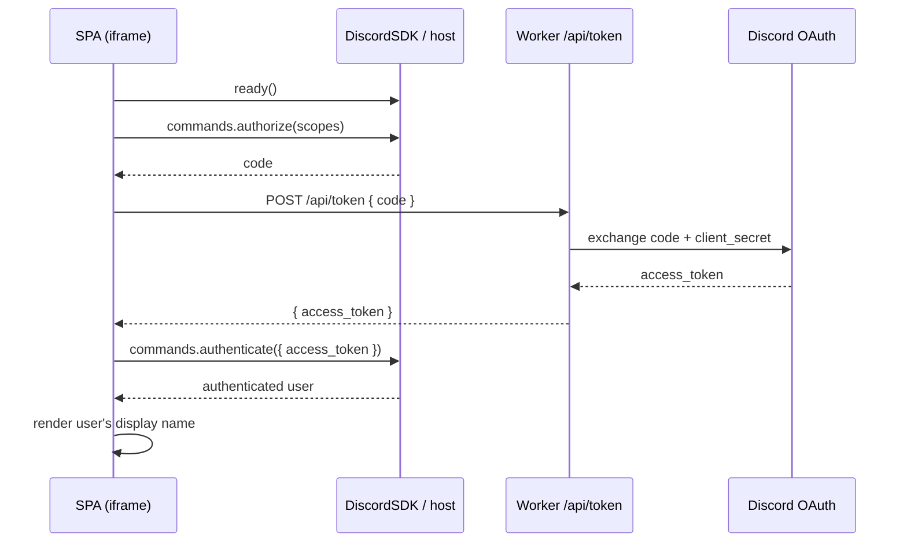

# Phase 1 Plan — Boot the Activity

The goal of Phase 1 (see the roadmap in [technical-reference.md](technical-reference.md#5-suggested-phased-roadmap)) is to get the Discord Activity handshake working end‑to‑end and prove it by rendering the authenticated Discord user's name inside the SPA.

**Definition of done:** launching the Activity in a Discord voice channel loads the SPA in the iframe, completes `ready()` → `authorize()` → server token exchange → `authenticate()`, and displays the signed‑in user's display name.

---

## What already exists

- **Client ID is client‑side.** [src/libs/discord.ts](../src/libs/discord.ts) reads `VITE_DISCORD_CLIENT_ID` via `import.meta.env` and exports a singleton `DiscordSDK` plus a `proxyDiscordUrl` helper. The `discord.ts runs in the wrong place` concern from the TRD is already resolved.
- **CSP / frame ancestors** are set in the Worker fetch handler ([src/server/fetch/index.ts](../src/server/fetch/index.ts)) from `DISCORD_FRAME_ANCESTORS`, and `X-Frame-Options` is stripped so the iframe can render.
- **Env vars are typed** in [worker-configuration.d.ts](../worker-configuration.d.ts): `VITE_DISCORD_CLIENT_ID` (public), `DISCORD_CLIENT_SECRET` (server‑only), `DISCORD_FRAME_ANCESTORS`.
- **DB + schema** are in place ([src/db/schema.ts](../src/db/schema.ts)); `player` upsert is Phase 2, not required here.
- **Dev tunnel script** exists: `pnpm cloudflared:tunnel`.

---

## Scope of Phase 1

In scope:

1. A server route that exchanges an OAuth `code` for an `access_token`.
2. A client‑side SDK provider/hook that runs the full handshake and exposes auth state.
3. Wiring the provider into the router shell and rendering the authenticated user.
4. Minimal env/portal/proxy config needed to run the handshake in dev.

Out of scope (later phases): `player`/`game_player` upsert, channel→game binding, deal/play/pass API, table UI.

---

## Work breakdown

### 1. Server: OAuth token exchange route

- Add a server route (TanStack Start server route under [src/server](../src/server), reachable through the existing `tanstack.fetch` delegation) at e.g. `POST /api/token`.
- Input: `{ code: string }` (validate with `zod`).
- Exchange against `https://discord.com/api/oauth2/token` using `application/x-www-form-urlencoded` with:
  - `client_id` = `VITE_DISCORD_CLIENT_ID`
  - `client_secret` = `DISCORD_CLIENT_SECRET` (server‑only — never sent to the client)
  - `grant_type=authorization_code`
  - `code`
- Return only `{ access_token }` to the client. Do **not** leak the refresh token or secret.
- On failure, log via `logError` ([src/server/utils/logger.ts](../src/server/utils/logger.ts)) and return a non‑200 with a generic message.
- Requests from inside the iframe are proxied, so the client must call this route through the `/.proxy/` prefix (see §4).

### 2. Client: SDK auth provider

- Create a React provider/hook (e.g. `src/libs/discord-auth.tsx` or a `hooks/` file) that:
  1. Awaits `discord.ready()` (import the singleton from [src/libs/discord.ts](../src/libs/discord.ts)).
  2. Calls `discord.commands.authorize({ client_id, response_type: 'code', scope: ['identify', 'guilds.members.read', 'rpc.activities.write'], prompt: 'none' })`.
  3. `POST`s the returned `code` to `/api/token` (via `proxyDiscordUrl`) to get the `access_token`.
  4. Calls `discord.commands.authenticate({ access_token })` and stores the returned user.
- Expose `{ status: 'loading' | 'ready' | 'error', user, error }` through context.
- Guard against double‑invocation (React 18/19 strict effects) so the handshake runs once.

### 3. Wire into the shell + render user

- Wrap the app inside the provider in [src/routes/\_\_root.tsx](../src/routes/__root.tsx) (inside `I18nProvider`, around `main`).
- Update [src/routes/index.tsx](../src/routes/index.tsx) to read auth state and render the authenticated user's display name (loading / error states included).

### 4. Config: env, proxy, and portal

- Confirm `VITE_DISCORD_CLIENT_ID`, `DISCORD_CLIENT_SECRET`, `DISCORD_FRAME_ANCESTORS` are set locally (`.dev.vars` / Wrangler secrets) and in the deployed Worker.
- Decide the proxy prefix (`/.proxy/`) and register URL mappings in the Discord Developer Portal so the iframe can reach both assets and `/api/token`.
- Set the Activity's dev URL in the portal to the `cloudflared` tunnel URL (`pnpm cloudflared:tunnel`).

---

## Sequence

---

## Risks & decisions

- **Scopes.** Start minimal (`identify`); add `guilds.members.read` only if guild‑nickname resolution is needed in this phase.
- **Proxy correctness.** Most Phase‑1 bugs come from CSP/URL‑mapping mismatches — verify `/api/token` is reachable through `/.proxy/` before debugging app logic.
- **Handshake idempotency.** Ensure the effect runs once; a second `authorize()` can surface a consent prompt or error.
- **Secret hygiene.** `DISCORD_CLIENT_SECRET` must never reach the client bundle or be returned in the token response.

---

## Acceptance checklist

- [x] `POST /api/token` exchanges a code and returns only `access_token`.
- [x] Client completes `ready()` → `authorize()` → token exchange → `authenticate()` without errors.
- [x] The authenticated user's display name renders in the SPA.
- [x] No secrets are exposed to the client.
- [x] Verified running inside a real Discord voice channel via the dev tunnel.
