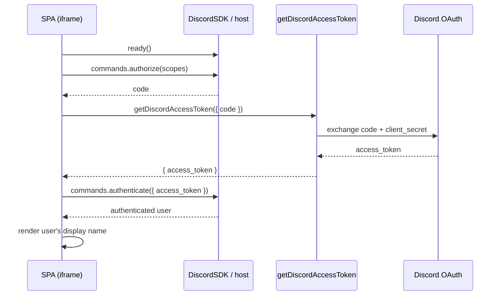

# Phase 1 Plan — Boot the Activity

> **Status: ✅ Complete.** File paths and symbol names below have been reconciled with the shipped code.

The goal of Phase 1 (see the roadmap in [technical-reference.md](technical-reference.md#5-phased-roadmap)) is to get the Discord Activity handshake working end‑to‑end and prove it by rendering the authenticated Discord user's name inside the SPA.

**Definition of done:** launching the Activity in a Discord voice channel loads the SPA in the iframe, completes `ready()` → `authorize()` → server token exchange → `authenticate()`, and displays the signed‑in user's display name.

---

## What already exists

- **Client ID + scopes are client‑side.** [src/libs/discord.ts](../src/libs/discord.ts) reads `VITE_DISCORD_CLIENT_ID` and `VITE_DISCORD_CLIENT_SCOPES` (pipe‑delimited) via `import.meta.env` and exports a singleton `DiscordSDK` (`discord`), the parsed `discordClientId` / `discordClientScopes`, plus a `proxyDiscordUrl` helper.
- **CSP / frame ancestors** are set in the Worker fetch handler ([src/server/fetch/index.ts](../src/server/fetch/index.ts)) from `DISCORD_FRAME_ANCESTORS`, and `X-Frame-Options` is stripped so the iframe can render.
- **Env vars are typed** in [worker-configuration.d.ts](../worker-configuration.d.ts): `VITE_DISCORD_CLIENT_ID` / `VITE_DISCORD_CLIENT_SCOPES` (public), `DISCORD_CLIENT_SECRET` / `DISCORD_OAUTH_TOKEN_URL` / `DISCORD_FRAME_ANCESTORS` (server‑only).
- **DB + schema** are in place ([src/db/schema.ts](../src/db/schema.ts)); `player` upsert is Phase 2, not required here.
- **Dev tunnel script** exists: `pnpm cloudflared:tunnel`.

---

## Scope of Phase 1

In scope:

1. A server route that exchanges an OAuth `code` for an `access_token`.
2. A client‑side SDK provider/hook that runs the full handshake and exposes auth state.
3. Wiring the provider into the router shell and rendering the authenticated user.
4. Minimal env/portal/proxy config needed to run the handshake in dev.

Out of scope (later phases): `player`/`game_player` upsert, channel→game binding, deal/play/pass API, table UI.

---

## Work breakdown

### 1. Server: OAuth token exchange (`getDiscordAccessToken`)

- Implemented as a `createServerFn({ method: 'POST' })` in [src/server/fetch/src/discord.ts](../src/server/fetch/src/discord.ts) (reachable through the existing `tanstack.fetch` delegation), **not** a hand‑rolled route.
- Input: `{ code: string }` (validated with `zod`).
- Exchange against `DISCORD_OAUTH_TOKEN_URL` using `application/x-www-form-urlencoded` with:
  - `client_id` = `VITE_DISCORD_CLIENT_ID`
  - `client_secret` = `DISCORD_CLIENT_SECRET` (server‑only — never sent to the client)
  - `grant_type=authorization_code`
  - `code`
- Returns only `{ access_token }` to the client. Refresh token / secret are never leaked.
- On failure, logs via `logError` ([src/server/utils/logger.ts](../src/server/utils/logger.ts)) and throws a generic `GET_DISCORD_ACCESS_TOKEN_ERROR`.
- Requests from inside the iframe are proxied through the `/.proxy/` prefix.

### 2. Client: SDK auth provider (`DiscordProvider`)

- [src/routes/-_discord.tsx](../src/routes/-_discord.tsx) defines `DiscordProvider` + `useDiscord()` which:
  1. Awaits `discord.ready()` (the singleton from [src/libs/discord.ts](../src/libs/discord.ts)).
  2. Calls `discord.commands.authorize({ client_id: discordClientId, response_type: 'code', prompt: 'none', scope: discordClientScopes })` (scopes come from `VITE_DISCORD_CLIENT_SCOPES`).
  3. Calls `getDiscordAccessToken({ code })` to get the `access_token`.
  4. Calls `discord.commands.authenticate({ access_token })` and stores the returned user.
  5. Bootstraps the participant list via `getInstanceConnectedParticipants()` (used from Phase 2 on).
- Exposes `{ status: 'loading' | 'ready' | 'error', user, participants, error }` (plus a derived `ready`) through context.
- A `useRef` guard ensures the handshake runs once under React strict effects.

### 3. Wire into the shell + render user

- `DiscordProvider` wraps the app in [src/routes/\_\_root.tsx](../src/routes/__root.tsx) (around `Header` + `main`).
- [src/routes/index.tsx](../src/routes/index.tsx) reads auth state and renders the loading splash until `ready`, then the game shell.

### 4. Config: env, proxy, and portal

- Confirm `VITE_DISCORD_CLIENT_ID`, `VITE_DISCORD_CLIENT_SCOPES`, `DISCORD_CLIENT_SECRET`, `DISCORD_OAUTH_TOKEN_URL`, `DISCORD_FRAME_ANCESTORS` are set locally (`.dev.vars` / Wrangler secrets) and in the deployed Worker.
- Proxy prefix is `/.proxy/`; register URL mappings in the Discord Developer Portal so the iframe can reach assets, server fns, and the WebSocket.
- Set the Activity's dev URL in the portal to the `cloudflared` tunnel URL (`pnpm cloudflared:tunnel`).

---

## Sequence

---

## Risks & decisions

- **Scopes.** Start minimal (`identify`); add `guilds.members.read` only if guild‑nickname resolution is needed in this phase.
- **Proxy correctness.** Most Phase‑1 bugs come from CSP/URL‑mapping mismatches — verify the server function is reachable through `/.proxy/` before debugging app logic.
- **Handshake idempotency.** Ensure the effect runs once; a second `authorize()` can surface a consent prompt or error.
- **Secret hygiene.** `DISCORD_CLIENT_SECRET` must never reach the client bundle or be returned in the token response.

---

## Acceptance checklist

- [x] `getDiscordAccessToken` exchanges a code and returns only `access_token`.
- [x] Client completes `ready()` → `authorize()` → token exchange → `authenticate()` without errors.
- [x] The authenticated user's display name renders in the SPA.
- [x] No secrets are exposed to the client.
- [x] Verified running inside a real Discord voice channel via the dev tunnel.
