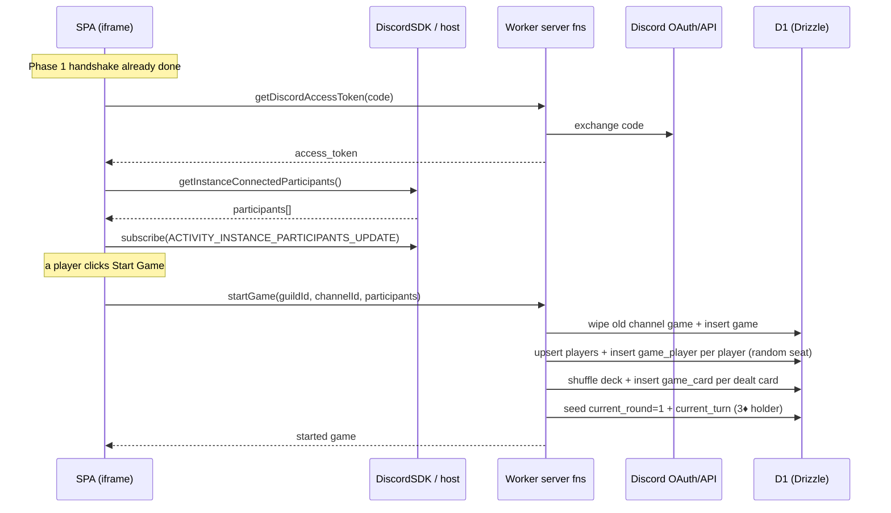

# Phase 2 Plan — Lobby: Upsert Players & Launch

> **Status: ✅ Complete.** File paths and symbol names below have been reconciled with the shipped code. Notably, the start-game logic lives in [src/server/fetch/src/game.ts](../src/server/fetch/src/game.ts) as `startGame` (not `startDiscordGame` in `discord.ts`), and the channel read is `getGameState` (there is no separate `getDiscordChannelGame`).

The goal of Phase 2 (see the roadmap in [technical-reference.md](technical-reference.md#5-phased-roadmap)) is to turn the authenticated Activity into a **lobby**: persist the signed-in user as a `player`, show everyone currently connected to the Activity instance, and expose a **Start Game** button that creates the `game` and joins the connected users.

**Definition of done:** after the Phase 1 handshake, the signed-in user is upserted into the `player` table, the SPA lists the participants connected to the Activity instance, and pressing **Start Game** creates a `game` row for the channel, a `game_player` row per connected user, and deals the deck.

> Note: dealing the deck and seeding the opening turn were pulled forward into `startGame` (they overlap with Phase 3), so a single launch action leaves the game immediately playable.

---

## What already exists

- **Auth handshake** completes end-to-end ([src/routes/-_discord.tsx](../src/routes/-_discord.tsx)) and exposes `{ status, user, participants, error }` (plus a derived `ready`) via `useDiscord()`.
- **Token-exchange server function** (`getDiscordAccessToken`) lives in [src/server/fetch/src/discord.ts](../src/server/fetch/src/discord.ts) using `createServerFn` — the pattern all new server functions follow.
- **DB + schema** are in place ([src/db/schema.ts](../src/db/schema.ts)): `player` (unique `discord_id`), `game` (`guild_id`, `channel_id`, `current_round`, `current_turn_player_id`, `current_play_id`; unique `channel_id`), and `game_player` (`game_id`, `player_id`, `seat`, `is_locked_out`, `placement`; unique on both `(game_id, player_id)` and `(game_id, seat)`), plus `game_card`, `play`, and `play_card` for dealt hands and future gameplay.
- **Drizzle client** is the default export of [src/db/index.ts](../src/db/index.ts), bound to D1 via `env.DB`.
- **Discord SDK** provides `commands.getInstanceConnectedParticipants()` and the `ACTIVITY_INSTANCE_PARTICIPANTS_UPDATE` event for the live participant list, plus `discord.channelId` / `discord.guildId` for the session binding.

---

## Scope of Phase 2

In scope:

1. A server function to **exchange the OAuth code** for an `access_token` (`getDiscordAccessToken`, Phase 1).
2. A server function to **start a game** (`startGame`): upsert all connected players, create the `game` for the channel, seat one `game_player` per player, deal the shuffled deck into `game_card`s, and seed the opening turn.
3. Client wiring to **read + subscribe to the participant list**.
4. A minimal **lobby view**: list connected users and a **Start Game** button that calls `startGame`.

Out of scope (Phase 3+): turn order enforcement, play/pass validation, and the polished table UI. (Dealing the deck + seeding the 3♦ opening turn were pulled forward into `startGame`.)

---

## Work breakdown

### 1. Server: `startGame` + `getGameState` ([src/server/fetch/src/game.ts](../src/server/fetch/src/game.ts))

- `getDiscordAccessToken` ([src/server/fetch/src/discord.ts](../src/server/fetch/src/discord.ts)) — validate `{ code }`; exchange it with Discord's token endpoint and return `{ access_token }`. (No player upsert here.)
- `startGame` — validate `{ guildId, channelId, players }`; wipe any existing game for the channel (cascades remove its `game_player`/`game_card` rows), insert a fresh `game`, upsert every player, then seat them in **random** order (0-based `seat`). It also **deals** the deck: shuffle all 52 cards, deal an even number per seat (leftovers discarded), and guarantee the 3♦ lands in a dealt hand by swapping it into range when needed. `game_card` rows are inserted in batches of 20 to stay under D1 statement limits. It finally seeds `current_round = 1` and `current_turn_player_id` (the 3♦ holder), then `notify()`s the channel DO. Returns the started `game`.
- `getGameState` — validate `{ channelId, discordId }`; return `{ status: 'found' | 'not-found', data }`. When found, `data` carries the game, the seated `players` (seat, username, avatar, `handCount`, turn/lockout/placement), the current table play, `isFreePlay`, `isObserver`, and **only the requesting user's own `hand`**. This single fn serves both the lobby-vs-game branch and live gameplay (Phase 3). There is no separate `getDiscordChannelGame`.
- All wrap work in `try/catch` and log via `logError`.
- D1 has no Drizzle transaction support, so writes are sequential inserts / a single `db.batch` (no `db.transaction`).

### 2. Client: auth + participant list ([src/routes/-_discord.tsx](../src/routes/-_discord.tsx))

- Run `authorize()` → `getDiscordAccessToken({ code })` → `authenticate({ access_token })`.
- Fetch the initial list with `commands.getInstanceConnectedParticipants()` and keep it fresh via `subscribe('ACTIVITY_INSTANCE_PARTICIPANTS_UPDATE', ...)`.
- Expose the context value `{ status, user, participants, error }`.

### 3. Client: lobby + Start Game ([src/routes/index.tsx](../src/routes/index.tsx), [src/routes/-_game-start.tsx](../src/routes/-_game-start.tsx))

- On ready, `index.tsx` runs `getGameState` via React Query (`getGameStateQueryOptions`). While connecting/loading it shows [-_game-splashscreen.tsx](../src/routes/-_game-splashscreen.tsx).
- If `status === 'found'` it renders the [-_game-board.tsx](../src/routes/-_game-board.tsx) (Phase 3/4); otherwise it renders `GameStart` — the lobby list of non-bot participants plus a **Start Game** button that calls `startGame` with `discord.guildId`, `discord.channelId`, and the participant list.
- Observer handling is server-driven: `getGameState` sets `isObserver` for a user who isn't seated; the game board surfaces an "observer mode" toast and hides the hand/controls (Phase 4).

---

## Sequence

---

## Risks & decisions

- **Duplicate games (decided).** Past game data isn't retained: launching wipes any existing game for the channel and its child rows before creating the new one. `game.channel_id` is unique (one game per channel), and there is no `status` column. On load, if a game already exists for the channel the SPA shows the game board instead of the lobby.
- **Who may launch (revised).** There is **no host gating** in the shipped code — every non-observer sees an enabled **Start Game** button. Simultaneous launches are made safe by `startGame` itself: it always wipes-then-recreates the channel's game as a single fresh deal, and the realtime `update` broadcast pushes every connected client onto the resulting board. (A near-simultaneous double launch just reshuffles once more.)
- **Bots (decided).** Participants with `bot: true` are filtered out before seating.
- **Late joiners / observers (decided).** Seating is fixed at launch. Anyone who opens the Activity after the game started and is not in `game_player` is an **observer** — `getGameState` reports `isObserver: true` and the board hides their hand/controls and shows a toast.
- **Seat order (decided).** Seats are assigned in **random** order at launch (players are shuffled before seating), not in participant-list order.
- **Participant vs. player identity.** Participants come from the SDK; `player` rows are keyed by `discord_id`. `startGame` upserts participants so seating never references a missing player.
- **Avatar (decided).** The participant's raw `avatar` hash is stored on `player.avatar_url` as-is; building the full CDN URL is done in the UI (`PlayerAvatar`).

---

## Acceptance checklist

- [x] Connected participants are upserted into `player` during `startGame` (idempotent by `discord_id`).
- [x] The SPA lists the participants connected to the Activity instance and updates on join/leave.
- [x] **Start Game** wipes any prior game for the channel, then creates one `game` row and one `game_player` per connected user with unique, randomized seats.
- [x] **Start Game** deals the shuffled deck into `game_card` rows, guaranteeing the 3♦ is dealt, and seeds `current_round = 1` + the opening turn.
- [x] Re-opening the Activity for a channel with an existing game shows the game board instead of the lobby.
- [x] A user who joins after launch and is not seated in `game_player` is shown as an observer (watch-only).
- [x] Server functions log failures via `logError` and never leak secrets.
