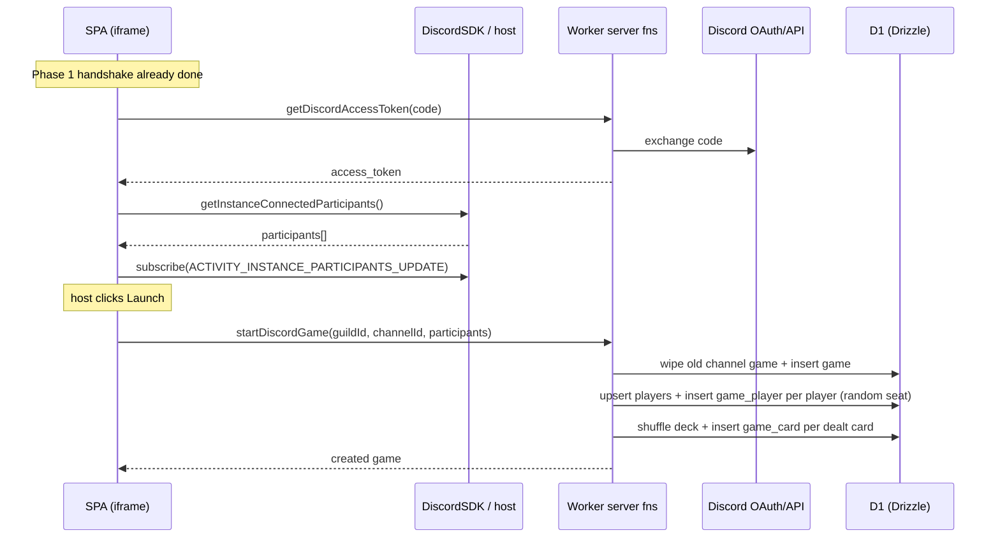

# Phase 2 Plan — Lobby: Upsert Players & Launch

The goal of Phase 2 (see the roadmap in [technical-reference.md](technical-reference.md#5-suggested-phased-roadmap)) is to turn the authenticated Activity into a **lobby**: persist the signed-in user as a `player`, show everyone currently connected to the Activity instance, and expose a **Launch** button that creates the `game` and joins the connected users — without starting any actual gameplay yet.

**Definition of done:** after the Phase 1 handshake, the signed-in user is upserted into the `player` table, the SPA lists the participants connected to the Activity instance, and pressing **Launch** creates a `game` row for the channel and a `game_player` row per connected user.

> Layout/styling is explicitly out of scope — the focus is correct data flow and persistence.

---

## What already exists

- **Auth handshake** completes end-to-end ([src/routes/-_discord.tsx](../src/routes/-_discord.tsx)) and exposes `{ status, user, participants, error }` via `useDiscord()`.
- **Token-exchange server function** lives in [src/server/fetch/src/discord.ts](../src/server/fetch/src/discord.ts) using `createServerFn` — the pattern all new server functions follow.
- **DB + schema** are in place ([src/db/schema.ts](../src/db/schema.ts)): `player` (unique `discord_id`), `game` (`guild_id`, `channel_id`, `current_round`, `current_turn_player_id`, `current_play_id`; unique `channel_id`), and `game_player` (`game_id`, `player_id`, `seat`, `is_locked_out`, `placement`; unique on both `(game_id, player_id)` and `(game_id, seat)`), plus `game_card`, `play`, and `play_card` for dealt hands and future gameplay.
- **Drizzle client** is the default export of [src/db/index.ts](../src/db/index.ts), bound to D1 via `env.DB`.
- **Discord SDK** provides `commands.getInstanceConnectedParticipants()` and the `ACTIVITY_INSTANCE_PARTICIPANTS_UPDATE` event for the live participant list, plus `discord.channelId` / `discord.guildId` for the session binding.

---

## Scope of Phase 2

In scope:

1. A server function to **exchange the OAuth code** for an `access_token`.
2. A server function to **start a game**: upsert all connected players, create the `game` for the channel, seat one `game_player` per player, and deal the shuffled deck into `game_card`s.
3. Client wiring to **read + subscribe to the participant list**.
4. A minimal **lobby view**: list connected users and a **Launch** button that calls the start-game server function.

Out of scope (later phases): turn order, play/pass validation, realtime sync beyond the participant list, and any table/hand UI or styling. (Dealing the deck was pulled forward into `startDiscordGame` — see below.)

---

## Work breakdown

### 1. Server: `getDiscordAccessToken`, `startDiscordGame`, `getDiscordChannelGame` ([src/server/fetch/src/discord.ts](../src/server/fetch/src/discord.ts))

- `getDiscordAccessToken` — validate `{ code }`; exchange it with Discord's token endpoint and return `{ access_token }`. (No player upsert here — that happens in `startDiscordGame`.)
- `startDiscordGame` — validate `{ guildId, channelId, players }`; wipe any existing game for the channel (cascades remove its `game_player`/`game_card` rows), insert a fresh `game`, upsert every player, then seat them in **random** order (0-based `seat`). It also **deals** the deck: shuffle all 52 cards, deal an even number per seat (leftovers discarded), and guarantee the 3♦ lands in a dealt hand by swapping it into range when needed. `game_card` rows are inserted in batches of 20 to stay under D1 statement limits. Returns the created `game`.
- `getDiscordChannelGame` — validate `{ channelId }`; return the channel's game plus its seated players (`seat`, `discordId`, `username`, `avatarUrl`, ordered by seat), or `null` when none exists. `discordId` lets the client tell whether the current user is seated or an observer.
- All wrap work in `try/catch` and log via `logError`.
- D1 has no Drizzle transaction support, so writes are sequential inserts (no `db.transaction`).

### 2. Client: auth + participant list ([src/routes/-_discord.tsx](../src/routes/-_discord.tsx))

- Run `authorize()` → `getDiscordAccessToken({ code })` (exchanges the token) → `authenticate({ access_token })`.
- Fetch the initial list with `commands.getInstanceConnectedParticipants()` and keep it fresh via `subscribe('ACTIVITY_INSTANCE_PARTICIPANTS_UPDATE', ...)`.
- Expose the context value `{ status, user, participants, error }`.

### 3. Client: lobby / active game + Launch ([src/routes/index.tsx](../src/routes/index.tsx))

- On ready, call `getDiscordChannelGame`; if a game exists, show it (seated players) instead of the launch screen.
- If a game exists and the current user is **not** among its seated players, treat them as an **observer**: show the game view with a note that they can only watch (they joined after launch and were not dealt in).
- Otherwise render the connected participants (bots filtered) and a **Launch** button that calls `startDiscordGame` with `discord.guildId`, `discord.channelId`, and the participant list, then refetches the game.
- **Only the host** — the first non-bot participant to join the Activity — sees an enabled **Launch** button; everyone else sees it disabled with a note naming the host. This avoids two users launching (and wiping/redealing) simultaneously.

---

## Sequence

---

## Risks & decisions

- **Duplicate games (decided).** Past game data isn't retained: launching wipes any existing game for the channel and its `game_player` rows before creating the new one. `game.channel_id` is unique (one game per channel), and the `status` column was dropped. On load, if a game already exists for the channel the SPA shows the active game instead of the launch screen.
- **Who may launch (decided).** Only the host — the first non-bot participant to join the Activity — can press Launch. The button is disabled for everyone else, preventing simultaneous launches from racing to wipe and redeal the game.
- **Bots (decided).** Participants with `bot: true` are always filtered out before seating.
- **Late joiners / observers (decided).** Seating is fixed at launch. Anyone who opens the Activity after the game started and is not in `game_player` is an **observer** — they see the game but cannot play. Membership is checked client-side by matching the user's Discord id against the seated players' `discordId`.
- **Seat order (decided).** Seats are assigned in **random** order at launch (players are shuffled before seating), not in participant-list order.
- **Participant vs. player identity.** Participants come from the SDK; `player` rows are keyed by `discord_id`. `startDiscordGame` upserts participants so seating never references a missing player.
- **Avatar (decided).** The participant's raw `avatar` value is stored on `player.avatar_url` as-is; building a full CDN URL (`cdn.discordapp.com/avatars/{id}/{hash}.png`) is deferred to the UI phase.

---

## Acceptance checklist

- [x] Connected participants are upserted into `player` during `startDiscordGame` (idempotent by `discord_id`).
- [x] The SPA lists the participants connected to the Activity instance and updates on join/leave.
- [x] Only the host (first non-bot participant to join) can press **Launch**.
- [x] **Launch** wipes any prior game for the channel, then creates one `game` row and one `game_player` per connected user with unique, randomized seats.
- [x] **Launch** deals the shuffled deck into `game_card` rows, guaranteeing the 3♦ is dealt.
- [x] Re-opening the Activity for a channel with an existing game shows that game instead of the launch screen.
- [x] A user who joins after launch and is not seated in `game_player` is shown as an observer (watch-only).
- [x] Server functions log failures via `logError` and never leak secrets.
