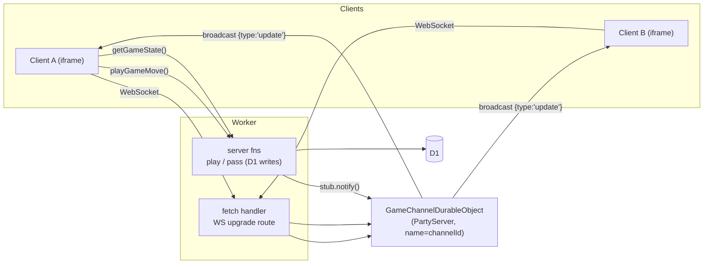
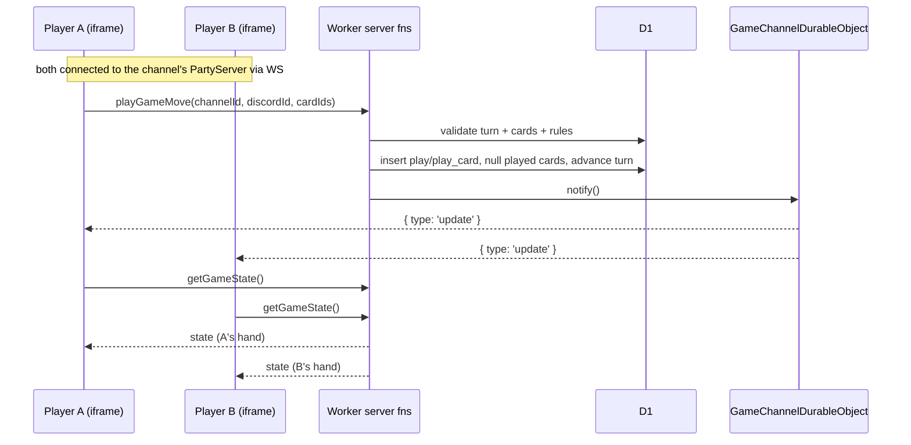

# Phase 3 Plan — Game API + Realtime (PartyServer)

> **Status: ✅ Complete.** Realtime was built with **PartyServer** (a thin ergonomic layer over Cloudflare Durable Objects) rather than a hand-rolled DO. File paths and symbol names throughout this doc have been reconciled with the shipped code.

The goal of Phase 3 (see the roadmap in [technical-reference.md](technical-reference.md#5-phased-roadmap)) is to make the launched game **playable**: implement the play/pass API that enforces the rules in [AGENTS.md](../AGENTS.md), and push state changes to every connected client in realtime using a **PartyServer Durable Object** per channel.

**Definition of done:** after a game is launched (Phase 2), the seated players can take turns; a `play` (a valid combination that beats the table) or a `pass` is validated server-side, persisted to D1, and every connected client is notified over a WebSocket and re-renders the new state — all through a bare-bones UI.

> UI/styling stays intentionally minimal. The focus is the rules engine, the play/pass endpoints, and the PartyServer realtime relay.

---

## What already exists

- **Full schema** ([src/db/schema.ts](../src/db/schema.ts)) already models everything gameplay needs — nothing new to migrate:
  - `game.current_round`, `game.current_turn_player_id` (→ `game_player.id`), `game.current_play_id` (→ `play.id`).
  - `game_player.is_locked_out`, `game_player.placement`.
  - `game_card.game_player_id` — set = in a hand, `null` = played to the table.
  - `play` (`round`, `type`, `is_pass`, `beats_play_id`) + `play_card` (unique `game_card_id`).
  - `CARD_RANKS` (low→high `3…2`) and `CARD_SUITS` (low→high `diamonds…spades`) constants for ordering.
- **Launch deals + seeds the turn** ([src/server/fetch/src/game.ts](../src/server/fetch/src/game.ts)): `startGame` seats players, deals `game_card`s, guarantees the 3♦ is dealt, seeds `current_turn_player_id` (3♦ holder) + `current_round = 1`, and `notify()`s the channel's PartyServer so lobby clients flip into the game in realtime.
- **Server-fn pattern** — all server logic uses `createServerFn({ method: 'POST' }).validator(zod).handler(...)`, wrapped in `try/catch` + `logError`.
- **Fetch handler** ([src/server/fetch/index.ts](../src/server/fetch/index.ts)) delegates every request to `tanstack.fetch` and rewrites CSP/`X-Frame-Options`. This is where a WebSocket upgrade route must be intercepted before delegation.
- **Worker entry** ([src/server/index.ts](../src/server/index.ts)) exports `{ fetch }`; a Durable Object class must also be exported here.
- **Client** — `useDiscord()` exposes `{ status, user, participants, error }`; [src/routes/index.tsx](../src/routes/index.tsx) already fetches the channel game and branches into lobby / active-game / observer views.

---

## Scope of Phase 3

In scope:

1. A pure **rules engine** that classifies a set of cards into a valid hand type and compares two plays ("beats").
2. Seed the **initial turn** at launch: set `current_turn_player_id` to the 3♦ holder and `current_round = 1`.
3. Server functions: **`getGameState`**, **`playGameMove`**, **`passGameMove`** — all rule-enforcing and D1-persisting.
4. A **`GameChannelDurableObject`** (a PartyServer `Server`, one per channel) that relays a lightweight "state changed" signal to all connected WebSocket clients.
5. **Wiring**: route WS via `routePartykitRequest`, export the DO from the Worker entry, add the binding/migration in `wrangler.jsonc`, and have mutations `notify()` the DO after committing.
6. A **bare-bones client**: open a `PartySocket`, expose a revalidate signal, show the current turn + the player's own hand, and add **Play** / **Pass** buttons.

Out of scope (later phases): polished table/hand UI, animations, reconnection/backoff niceties, spectator chat, multi-game history, and end-of-game scoreboards beyond raw `placement` values.

---

## Realtime architecture (PartyServer)

One PartyServer `Server` instance per channel is the natural unit (mirrors "one game per channel"). It is a **pub/sub relay only** — it does not own game logic or touch D1. This keeps all persistence/validation in the existing server-fn + Drizzle path and avoids duplicating logic inside the DO.

- **Connect**: the client opens a `PartySocket` to the proxied path `/.proxy/parties/game-channel-durable-object/<channelId>` (PartyServer's `parties/:server/:name` route, where `:server` is the kebab-cased binding name). The fetch handler runs `routePartykitRequest(request, env)` first and returns its response when it matches, before delegating to `tanstack.fetch`.
- **Hibernation**: the `Server` sets `static options = { hibernate: true }` so idle rooms cost nothing.
- **Notify**: after a successful `startGame` / `playGameMove` / `passGameMove` D1 write, the server fn resolves the DO with `getServerByName(env.GameChannelDurableObject, channelId)` and calls its `notify()` RPC. `notify()` accepts an optional typed message and `this.broadcast(...)`s it to every socket in the room — `{ type: 'update' }` by default, or `{ type: 'gameover', data: { discordId, username } }` when a player wins.
- **Refetch, don't push**: the `update` broadcast is a _signal_, not the state. On receiving it, each client re-runs `getGameState` (via React Query invalidation). This keeps the DO tiny (no serialization, no DB binding) and gives every client a correctly-scoped view (each player only sees their own hand). The `gameover` message is the one exception — it carries the winner's public identity so clients can render the end-of-game overlay before the game row is gone.

---

## Rules engine (pure, no DB)

Module `src/server/utils/game.ts` — pure functions, unit-testable, no `env`/DB imports.

- **Ordering** — derive `rankIndex` / `suitIndex` from the existing `CARD_RANKS` / `CARD_SUITS` arrays (index = strength); a card's overall strength is `rankIndex * 4 + suitIndex`.
- **`evaluateGameHand(cards)`** → `GameEvaluatedHand | null` where `type` is one of `single | pair | straight | flush | full_house | straight_flush` and the hand carries a comparable strength. Returns `null` for any set that matches no valid type (rejected upstream).
  - single (1), pair (2 same rank), straight (5 sequential ranks by index, mixed suits), flush (5 same suit), full house (3+2), straight flush (5 sequential + same suit).
- **`gameBeats(candidate, current)`** → `boolean`, applying the promotion table from [AGENTS.md](../AGENTS.md):
  - single→higher single; pair→higher pair; straight→higher straight/flush/full house/straight flush; flush→higher flush/full house/straight flush; full house→higher full house/straight flush; straight flush→higher straight flush only.
  - "Higher" comparison keys: singles/pairs by rank then suit; straights & (straight) flushes by highest card rank then suit; flushes by highest card rank then suit; full houses by the triple's rank.

Decisions baked in (see Risks): straights do **not** wrap around; `2` is the highest single rank per `CARD_RANKS`.

---

## Work breakdown

### 1. Seed the initial turn at launch ([src/server/fetch/src/game.ts](../src/server/fetch/src/game.ts))

- In `startGame`, after dealing, compute the `game_player` who holds the 3♦ and update the game: `current_turn_player_id = <that game_player.id>`, `current_round = 1`. (done)

### 2. Rules engine ([src/server/utils/game.ts](../src/server/utils/game.ts))

- Implement `evaluateGameHand` and `gameBeats` as described above, plus small `rankIndex`/`suitIndex` helpers. No comments (per AGENTS.md conventions).

### 3. Game server functions ([src/server/fetch/src/game.ts](../src/server/fetch/src/game.ts), new sibling to `discord.ts`)

- **`getGameState({ channelId, discordId })`** — return a client-safe snapshot:
  - `game` (round, current turn `game_player.id`, current play id).
  - `players`: seat, username, `handCount` (count of `game_card` still held), `isLockedOut`, `placement`, and whether it is their turn.
  - `currentPlay`: the table play's type + its cards (so clients can see what to beat).
  - `hand`: the requesting player's own `game_card`s (only theirs — never leak other hands).
- **`playGameMove({ channelId, discordId, cardIds })`** —
  1. Load game + the acting `game_player`; reject if not found or not their turn.
  2. Load the referenced `game_card`s; reject if any aren't currently held by this player.
  3. `evaluateGameHand(cards)`; reject if `null`.
  4. If this is the **very first play of the game** (round 1, no prior non-pass plays), require the set to include the 3♦.
  5. If there is a `current_play` to beat, require `gameBeats(candidate, current)`; otherwise (opener/free play) any valid combination is allowed.
  6. Persist: insert `play` (+ `beats_play_id`), insert `play_card`s, set the played `game_card.game_player_id = null`, set `game.current_play_id` to the new play.
  7. **Win check**: if the player now holds 0 cards, set their `placement` and end the game — the game currently **deletes** the `game` row (cascading its children) and `notify()`s a `gameover` message carrying the winner's `{ discordId, username }`. (Ranking out the remaining players into a full placement order is a future enhancement.)
  8. **Advance turn**: otherwise set `current_turn_player_id` to the next non-locked, non-finished seat (clockwise by `seat`).
  9. Notify the DO.
- **`passGameMove({ channelId, discordId })`** —
  1. Load game + acting player; reject if not their turn.
  2. Reject a pass when there is **no** `current_play` (can't pass an opener/free play).
  3. Insert a pass `play` (`is_pass = true`), set `game_player.is_locked_out = true`.
  4. **Round end**: if only one non-locked, non-finished player remains, that player starts the next round — increment `current_round`, clear `current_play_id`, reset every remaining player's `is_locked_out = false`, and set `current_turn_player_id` to that player.
  5. Otherwise advance the turn to the next non-locked player.
  6. Notify the DO.
- All three wrap work in `try/catch` + `logError`, export granular `*_ERROR` constants and `*Request`/`*Response` types, matching `discord.ts`. The catch logs the specific failure and rethrows a generic per-endpoint error.
- **Minimize round-trips (done).** Each endpoint does a **single** `db.query.game.findFirst({ with: {...} })` relational read that pulls players, their hands, prior-play existence, and the current table play; all validation runs against that in-memory graph. Mutations commit in a **single** `db.batch([...])` (the new `play` id is generated with `crypto.randomUUID()` so `play_card` rows reference it inside the same batch). Placement and next-turn are computed in JS from the loaded players. So `getGameState` = 1 call, `playGameMove` / `passGameMove` = 2 calls each (D1 has no Drizzle transactions; `db.batch` is the atomic write path).

### 4. `GameChannelDurableObject` ([src/server/fetch/src/game-channel.ts](../src/server/fetch/src/game-channel.ts))

- A PartyServer `Server<Env>` subclass with `static options = { hibernate: true }`. A single `notify(message?)` RPC method `this.broadcast(JSON.stringify(message))`s the given typed message (defaulting to `{ type: 'update', data: null }`); connection lifecycle (accept/close/error) is handled by PartyServer. No D1 binding, no stored state required. The message union (`update` | `gameover`) is exported from this file and shared with the client.

### 5. Wire the DO into the Worker

- **Export** `GameChannelDurableObject` from [src/server/index.ts](../src/server/index.ts) alongside the default `{ fetch }`. The re-export **must not be aliased** — an alias breaks wrangler's DO type generation so the binding degrades to an untyped namespace and RPC methods like `notify()` vanish.
- **Route** WS in [src/server/fetch/index.ts](../src/server/fetch/index.ts): call `routePartykitRequest(request, env)` first and return its response when non-null; otherwise fall through to `tanstack.fetch` (existing behavior + CSP rewrite).
- **`wrangler.jsonc`**: add a `durable_objects.bindings` entry (`name` and `class_name` both `GameChannelDurableObject`) and a `migrations` entry (`new_sqlite_classes: ["GameChannelDurableObject"]`).
- Regenerate types via `pnpm wrangler:types` so `Env.GameChannelDurableObject` is typed in [worker-configuration.d.ts](../worker-configuration.d.ts).
- Mutations reach the DO through the binding: `(await getServerByName(env.GameChannelDurableObject, channelId)).notify()`.

### 6. Bare-bones client

- **Realtime hook** (`useDiscordRealtime` in [src/routes/-_discord.tsx](../src/routes/-_discord.tsx)): open a `PartySocket` (`host: <clientId>.discordsays.com`, `prefix: '.proxy/parties'`, `party: 'game-channel-durable-object'`, `room: channelId`) once ready, and dispatch on each message — `update` → `onUpdate` (the caller invalidates the `gameState` React Query), `gameover` → `onGameOver` (the caller stashes the winner for the overlay). The hook is wired from `HomePageGameShell` in [src/routes/index.tsx](../src/routes/index.tsx) so lobby players are already connected when someone launches and get pushed into the game.
- **Game view** ([src/routes/index.tsx](../src/routes/index.tsx) + [-_game-board.tsx](../src/routes/-_game-board.tsx)): on ready and on every `update`, React Query re-fetches `getGameState`. Render whose turn it is, each player's remaining card count, the current table play, and the user's own hand, with **Play** / **Pass** buttons that call the server fns and are disabled when it isn't the user's turn or they're an observer/finished. (The polished table presentation is Phase 4.)

---

## Sequence (a turn)

---

## Risks & decisions

- **DO as relay, not authority (decided).** The Durable Object only broadcasts a signal; validation + persistence stay in server fns writing to D1. Simpler, single source of truth, no logic duplication. Trade-off: a client refetch per update (fine at this scale).
- **Signal, not state, over the wire (decided).** Broadcasting `{ type: 'update' }` (vs. full state) avoids leaking other players' hands and keeps the DO free of DB access.
- **Turn/round seeding (decided).** `startGame` sets the initial turn (3♦ holder) and `current_round = 1` so `getGameState` has a valid turn immediately after launch.
- **First-play 3♦ enforcement (decided).** Required only on the very first play of the game (round 1, no prior non-pass play), matching AGENTS.md.
- **Straights don't wrap (decided).** Sequential strictly by `CARD_RANKS` index; `2` is the top single. Revisit only if house rules differ.
- **No transactions on D1 (constraint).** Multi-row mutations are sequential inserts/updates; acceptable given single-writer-per-turn and the DO-serialized notify. A mid-write failure is logged and surfaced as a generic error.
- **WS proxy/CSP (risk).** Like Phase 1, the WS path must be reachable through Discord's `/.proxy/` mapping; verify the upgrade route before debugging game logic. `connect-src`/`frame-ancestors` in the CSP may need the `wss://` origin.
- **Concurrency (accepted).** Two near-simultaneous plays are guarded by the "is it your turn?" check; the second read sees the advanced turn and is rejected. Good enough without DO-level locking.
- **Auth on the WS (accepted for now).** The socket carries no per-user auth; it only receives content-free "update" pings, and all sensitive reads go through authenticated server fns. Hardening the WS handshake is deferred.

---

## Acceptance checklist

- [x] `startGame` seeds `current_turn_player_id` (3♦ holder) and `current_round = 1`.
- [x] `src/server/utils/game.ts` classifies all six hand types and rejects invalid sets; `gameBeats` implements the AGENTS.md promotion table.
- [x] `playGameMove` enforces turn, ownership, valid hand type, beat/opener rules, and first-play 3♦; persists `play`/`play_card`, empties played cards, and advances the turn.
- [x] `passGameMove` rejects passing a free play, locks the player out, and ends the round (new round, unlock all, winner leads) when one player remains.
- [x] Emptying a hand records `placement`, ends the game (deletes the `game` row), and broadcasts a `gameover` message; mid-game the turn skips finished/locked players.
- [x] `getGameState` returns only the requesting player's hand plus public per-player counts and the table play.
- [x] The `GameChannelDurableObject` PartyServer is bound + migrated; WS is routed via `routePartykitRequest`; mutations `notify()` it and all connected clients refetch.
- [x] Bare-bones UI lets a seated player select cards, **Play** or **Pass**, and see other clients update in realtime.
- [x] All new server fns log failures via `logError` and never leak other players' hands or secrets.
