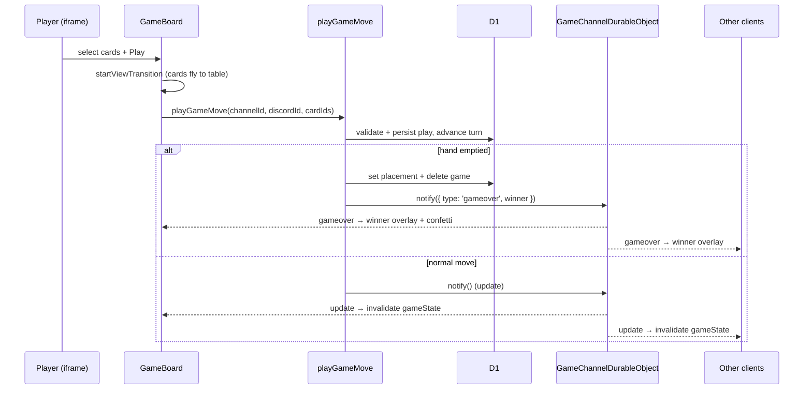

# Phase 4 Plan — UI & Realtime Polish

> **Status: ✅ Complete.** This doc was written after the fact to describe the shipped table UI; every item below is implemented. File paths and symbol names are reconciled with the code.

The goal of Phase 4 (see the roadmap in [technical-reference.md](technical-reference.md#5-phased-roadmap)) is to replace the bare-bones Phase 3 UI with a **polished, animated table experience** and finish the realtime loop — including an end-of-game flow — so the game is presentable end-to-end inside Discord.

**Definition of done:** a seated player sees an oval poker table with everyone seated around it, can select cards and **Play** / **Pass** with smooth animations, watches opponents' moves arrive in realtime, and gets a celebratory game-over overlay (with confetti) that returns them to the lobby. Observers get a watch-only view. Loading is covered by a branded splash.

Branding throughout is **中国人 POKER**.

---

## What already existed (Phases 1–3)

- Auth handshake + participant list ([src/routes/-_discord.tsx](../src/routes/-_discord.tsx)).
- `startGame` / `getGameState` / `playGameMove` / `passGameMove` server fns ([src/server/fetch/src/game.ts](../src/server/fetch/src/game.ts)) with the pure rules engine ([src/server/utils/game.ts](../src/server/utils/game.ts)).
- The `GameChannelDurableObject` realtime relay ([src/server/fetch/src/game-channel.ts](../src/server/fetch/src/game-channel.ts)) broadcasting `update` / `gameover`.
- `getGameState` already returns a client-safe snapshot including `isObserver`, `isFreePlay`, per-player `handCount` / turn / lockout, the current table play, and the requesting user's own `hand`.

---

## Scope of Phase 4

In scope:

1. **State plumbing** with TanStack React Query (single `gameState` query, invalidated by realtime signals).
2. A **loading splash** for the connecting / loading window.
3. A **lobby** screen (participant list + Start Game).
4. A **table** screen: seats around an oval, current-turn cues, the table play, a selectable hand, Play/Pass, and animated card plays.
5. **Observer mode** presentation.
6. An **end-of-game** overlay driven by the `gameover` realtime message, with confetti and a return-to-menu path.
7. Chrome: a **Header** (reload / leaderboard placeholder / rules guide modal).

Out of scope (Phase 5): deploy hardening, portal URL-mapping/CSP finalization, and a persistent leaderboard (the header button is a disabled placeholder).

---

## Work breakdown

### 1. State plumbing ([src/routes/index.tsx](../src/routes/index.tsx))

- `getGameStateQueryOptions` / `gameStateQueryKey` ([src/server/fetch/src/game.ts](../src/server/fetch/src/game.ts)) drive a single React Query (`staleTime: 0`, `gcTime: 0`) keyed by `channelId` + `discordId`.
- `HomePage` shows the splash while `!ready` or the query is loading; otherwise `HomePageGameShell` renders the board when `status === 'found'`, else the lobby.
- Mutations (`startGame`, `playGameMove`, `passGameMove`) go through `useServerFn` + `useMutation`.
- `useDiscordRealtime({ onUpdate, onGameOver })` invalidates the `gameState` query on `update` and stores the winner (`gameOverWinner` state) on `gameover`.

### 2. Loading splash ([src/routes/-_game-splashscreen.tsx](../src/routes/-_game-splashscreen.tsx))

- Branded hero with four bouncing `PlayingCard`s (staggered animation delays), a spinner, and a `loadingMessage` prop (`Connecting to Discord...` vs `Loading Game...`).

### 3. Lobby ([src/routes/-_game-start.tsx](../src/routes/-_game-start.tsx))

- Branded hero (four `5`s), a `Surface` panel listing non-bot participants (`PlayerAvatar` + global/username), an "N in lobby" count chip, and a full-width **Start Game** button with a pending state.

### 4. Table / game board ([src/routes/-_game-board.tsx](../src/routes/-_game-board.tsx))

- **Oval table** — a `Surface` styled with radial gradients and layered borders. Its size is tracked with `useResizeObserver` so seats reflow responsively.
- **Seating** — players are ordered by `seat` and rotated so **the current user sits at the bottom**; each seat's `x/y` is computed by `getPlayerPosition`, a stadium/oval-perimeter parametric function. Each seat shows a `PlayerAvatar`, a hand-count `Badge`, a `Pass` overlay when `isLockedOut`, and grayscale/dimming when it isn't that player's turn. A pulsing radial glow tracks the current-turn seat.
- **Table play** — the `currentPlay` cards render in the center with a capitalized type `Chip`; a `中国人 POKER` watermark shifts upward when a play is present.
- **Play animation** — selecting cards and pressing **Play** commits via `document.startViewTransition` + `flushSync`, using `viewTransitionName: card-<id>` so the chosen cards animate from the hand to the table. On server error the optimistic played cards roll back.
- **Hand** — the user's own cards render as selectable `PlayingCard` buttons (lift + accent ring when selected); disabled when it isn't their turn or the game is over.
- **Controls** — **Pass** and **Play** buttons with pending spinners; disabled appropriately (not your turn / nothing selected / game over).
- **Observer mode** — when `isObserver`, the hand and controls are hidden and a one-time "observer mode" toast explains why.

### 5. Game-over overlay ([src/routes/-_game-board.tsx](../src/routes/-_game-board.tsx))

- When a `gameOver` winner is present, a dimmed overlay covers the table showing "<winner> wins!", a congratulatory or sympathy line depending on whether the viewer won, and a **Return to Menu** button.
- `useConfetti(!!gameOver)` fires confetti on win.
- **Return to Menu** invalidates the `gameState` query and clears the winner — since `playGameMove` deleted the finished `game`, the refetch returns `not-found` and the client falls back to the lobby.

### 6. Header + guide ([src/routes/-_header.tsx](../src/routes/-_header.tsx), [src/routes/-_guide.tsx](../src/routes/-_guide.tsx))

- Fixed top-right controls: **Reload** (invalidate queries + router, hard reload), **Leaderboard** (disabled placeholder for Phase 5+), and a **Guide** modal.
- `Guide` is a static rules reference (card order, hand types, beating hands, turn/round flow, winning) mirroring [AGENTS.md](../AGENTS.md).

### 7. Shared components + hooks

- [src/components/playing-card.tsx](../src/components/playing-card.tsx) — renders a single card by `rank` / `suit`.
- [src/components/player-avatar.tsx](../src/components/player-avatar.tsx) — resolves the Discord avatar (building the CDN URL from the stored hash, with a fallback).
- [src/libs/hooks.ts](../src/libs/hooks.ts) — `useConfetti` and `useResizeObserver`.
- UI is built on **HeroUI** (`Button`, `Surface`, `Badge`, `Chip`, `Tooltip`, `Modal`, `Spinner`, `Typography`, `toast`) + Tailwind, with `ToastProvider` mounted in [\_\_root.tsx](../src/routes/__root.tsx).

---

## Sequence (a play, with animation + realtime)

---

## Risks & decisions

- **Optimistic play animation (decided).** The board optimistically moves selected cards to the table via view transitions and rolls back on server error, so the UI feels instant without trusting the client for state.
- **Self-at-bottom seating (decided).** Seats are rotated client-side so the viewer is always bottom-center; the underlying `seat` order is unchanged.
- **Game-over via realtime message (decided).** Because a win deletes the `game` row, the winner is delivered in the `gameover` broadcast payload rather than read back from `getGameState`; the subsequent refetch returns `not-found` and drops players back to the lobby.
- **Leaderboard deferred.** The header exposes a disabled leaderboard button; persistent placement history/scoreboard is out of scope until after deploy.
- **Realtime is a signal, not state (unchanged from Phase 3).** `update` only triggers a scoped refetch, so no hand ever leaks over the socket; only the public winner identity travels in `gameover`.

---

## Acceptance checklist

- [x] A branded splash covers the connecting / loading window.
- [x] The lobby lists non-bot participants and launches via **Start Game**.
- [x] The table seats all players around an oval with the viewer at the bottom, shows hand counts, lockout, and a current-turn cue.
- [x] The current table play and its type render in the center.
- [x] Selecting cards and pressing **Play** animates them to the table (view transitions) and rolls back on error.
- [x] **Play** / **Pass** are disabled when it isn't the user's turn, nothing is selected, or the game is over.
- [x] Opponents' moves arrive in realtime via `update` → React Query invalidation.
- [x] Observers get a watch-only board with an explanatory toast.
- [x] A `gameover` message renders a winner overlay with confetti and **Return to Menu** back to the lobby.
- [x] The header provides reload and a rules guide modal (leaderboard is a disabled placeholder).
