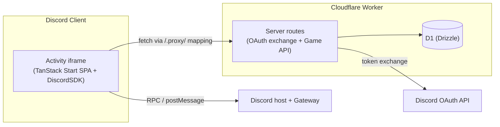

# Technical Reference

The central technical reference (TRD) for this project — a custom card game built as a **Discord Activity** on a TanStack Start SPA + Cloudflare Workers, with Drizzle + D1. This document is the hub; detailed topics branch out into their own linked docs.

Related code: [src/libs/discord.ts](../src/libs/discord.ts), [src/server](../src/server), [src/db/schema.ts](../src/db/schema.ts).

---

## 1. What "inside Discord" actually means

You're building a **Discord Activity** (Embedded App), not a bot. Concretely:

- The web app (the TanStack Start SPA) is loaded **inside an `<iframe>` in the Discord client** (desktop, web, and mobile) when a user launches the Activity in a voice channel or via the app launcher.
- Discord serves the app through its **proxy domain** (`https://<app-id>.discordsays.com/...`), not directly from the Worker URL. All network requests from inside the iframe are subject to Discord's **CSP and URL mapping** rules.
- The `@discord/embedded-app-sdk` (`DiscordSDK`) is the **bridge**: it talks over `postMessage`/RPC to the host Discord client to do OAuth, read the current channel/guild, fetch participants, set activity state, etc.
- The Cloudflare Worker is the **backend**: it handles the OAuth token exchange (client secret stays server-side) and exposes the game API + persistence (D1).

---

## 2. The launch + auth handshake (the core flow)

This is the sequence every session runs through:

1. **Load** — User starts the Activity; Discord loads the SPA in the iframe.
2. **`sdk.ready()`** — SPA waits for the SDK to connect to the host.
3. **`sdk.commands.authorize()`** — SPA requests an OAuth2 authorization `code` with the scopes needed (e.g. `identify`, `guilds.members.read`, `rpc.activities.write`).
4. **Code → token (server-side)** — SPA sends the `code` to the Worker; the Worker exchanges it with Discord's token endpoint using the **client secret** and returns an `access_token`.
5. **`sdk.commands.authenticate({ access_token })`** — SPA hands the token back to the SDK to finish the handshake. Now the authenticated Discord user is available.
6. **Bootstrap game context** — Read `sdk.channelId` / `sdk.guildId` and the participant list; upsert the `player` row and locate/create the `game` for that channel.

---

## 3. How the pieces map to the codebase

| Concern                          | Where it lives                                                        | Notes                                                              |
| -------------------------------- | --------------------------------------------------------------------- | ------------------------------------------------------------------ |
| SDK init + auth handshake        | client side (new hook/provider around the router)                     | must run in the **browser**, not the Worker                        |
| OAuth token exchange             | new server route in [src/server](../src/server)                       | uses `DISCORD_CLIENT_SECRET` — server-only                         |
| Game API (create/join/play/pass) | server routes                                                         | validates rules from [AGENTS.md](../AGENTS.md), writes via Drizzle |
| Persistence                      | [src/db/schema.ts](../src/db/schema.ts)                               | already done                                                       |
| Discord proxy/CSP config         | [wrangler.jsonc](../wrangler.jsonc) + Discord Dev Portal URL mappings | required so the iframe can reach the API and assets                |

---

## 4. Things to fix / decide before building

- **`discord.ts` runs in the wrong place.** [src/libs/discord.ts](../src/libs/discord.ts) imports `env` from `cloudflare:workers` and constructs `DiscordSDK` there. `DiscordSDK` is a **client-side** SDK and must be instantiated in the browser; `cloudflare:workers` env isn't available client-side. Move SDK init to client code and expose the **client ID** via a Vite public env var (it's public), while keeping the **client secret** server-only.
- **URL mapping / CSP.** Decide the proxy prefix (Discord commonly uses `/.proxy/`) and register the mappings in the Discord Developer Portal + reflect them in the app's fetch base URL.
- **Dev experience.** Local dev needs a public tunnel (e.g. `cloudflared`) pointed at the Vite/Worker dev server, with that URL set as the Activity's dev URL in the portal.
- **Session model.** Decide how a Discord voice channel maps to a `game` (one active game per channel is the natural fit given `game.channel_id`).

---

## 5. Suggested phased roadmap

- [x] **Phase 1 — Boot the Activity.** Fix `discord.ts`, add a client-side SDK provider, get `ready()` + `authorize()` + server token exchange + `authenticate()` working; render the authenticated user's name in the SPA. See [Phase 1 — Boot the Activity & Auth Plan](phase-1-boot-activity-auth-plan.md).
- [x] **Phase 2 — Lobby: upsert players & launch.** Show the participants connected to the Activity instance and a host-only launch button that, when pressed, upserts the connected users as `player`s, creates the `game` for the channel, seats them as `game_player`s (random order), and deals the shuffled deck into `game_card`s. See [Phase 2 — Lobby: Upsert Players & Launch](phase-2-lobby-launch-plan.md).
- [ ] **Phase 3 — Game API + realtime.** Implement play/pass endpoints enforcing the rules (dealing already happens at launch), plus a sync mechanism (polling first, then SDK activity events / Durable Object for realtime).
- [ ] **Phase 4 — UI.** Build the table/hand UI and wire it to the API.
- [ ] **Phase 5 — Deploy + portal config.** Finalize URL mappings, CSP, and Activity settings; test in a real voice channel.
