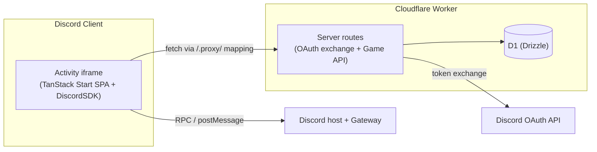

# Technical Reference

The central technical reference (TRD) for this project — a custom card game (branded **中国人 POKER**) built as a **Discord Activity** on a TanStack Start SPA + Cloudflare Workers, with Drizzle + D1 and a PartyServer Durable Object for realtime. This document is the hub; detailed topics branch out into their own linked docs.

> **Status:** Phases 1–4 are complete — the game is fully playable end-to-end inside Discord with a polished table UI and realtime sync. Only Phase 5 (deploy hardening / portal finalization) remains.

Related code: [src/libs/discord.ts](../src/libs/discord.ts), [src/server](../src/server), [src/db/schema.ts](../src/db/schema.ts), [src/routes](../src/routes), [src/components](../src/components).

Stack: **TanStack Start** (SPA + server functions) · **TanStack React Query** (client data/cache) · **HeroUI** + Tailwind (UI) · **Cloudflare Workers** + **D1** (Drizzle ORM) · **PartyServer** Durable Object (realtime) · **`@discord/embedded-app-sdk`** (Activity bridge).

---

## 1. What "inside Discord" actually means

You're building a **Discord Activity** (Embedded App), not a bot. Concretely:

- The web app (the TanStack Start SPA) is loaded **inside an `<iframe>` in the Discord client** (desktop, web, and mobile) when a user launches the Activity in a voice channel or via the app launcher.
- Discord serves the app through its **proxy domain** (`https://<app-id>.discordsays.com/...`), not directly from the Worker URL. All network requests from inside the iframe are subject to Discord's **CSP and URL mapping** rules.
- The `@discord/embedded-app-sdk` (`DiscordSDK`) is the **bridge**: it talks over `postMessage`/RPC to the host Discord client to do OAuth, read the current channel/guild, fetch participants, set activity state, etc.
- The Cloudflare Worker is the **backend**: it handles the OAuth token exchange (client secret stays server-side) and exposes the game API + persistence (D1).

---

## 2. The launch + auth handshake (the core flow)

This is the sequence every session runs through:

1. **Load** — User starts the Activity; Discord loads the SPA in the iframe.
2. **`sdk.ready()`** — SPA waits for the SDK to connect to the host.
3. **`sdk.commands.authorize()`** — SPA requests an OAuth2 authorization `code` with the scopes needed (e.g. `identify`, `guilds.members.read`, `rpc.activities.write`).
4. **Code → token (server-side)** — SPA sends the `code` to the Worker; the Worker exchanges it with Discord's token endpoint using the **client secret** and returns an `access_token`.
5. **`sdk.commands.authenticate({ access_token })`** — SPA hands the token back to the SDK to finish the handshake. Now the authenticated Discord user is available.
6. **Bootstrap game context** — Read `sdk.channelId` / `sdk.guildId` and the participant list; upsert the `player` row and locate/create the `game` for that channel.

---

## 3. How the pieces map to the codebase

| Concern                          | Where it lives                                                                                                  | Notes                                                                     |
| -------------------------------- | --------------------------------------------------------------------------------------------------------------- | ------------------------------------------------------------------------- |
| SDK singleton + proxy helper     | [src/libs/discord.ts](../src/libs/discord.ts)                                                                   | runs in the **browser**; client id/scopes from `import.meta.env`          |
| Auth handshake + realtime hooks  | [src/routes/-_discord.tsx](../src/routes/-_discord.tsx) (`DiscordProvider`, `useDiscord`, `useDiscordRealtime`) | provider wraps the app in [\_\_root.tsx](../src/routes/__root.tsx)        |
| OAuth token exchange             | `getDiscordAccessToken` in [src/server/fetch/src/discord.ts](../src/server/fetch/src/discord.ts)                | `createServerFn`; uses `DISCORD_CLIENT_SECRET` — server-only              |
| Game API (start/play/pass/state) | [src/server/fetch/src/game.ts](../src/server/fetch/src/game.ts)                                                 | `startGame` / `getGameState` / `playGameMove` / `passGameMove` server fns |
| Rules engine (pure)              | [src/server/utils/game.ts](../src/server/utils/game.ts)                                                         | `evaluateGameHand` / `gameBeats` / `sortGameCards`                        |
| Realtime relay                   | [src/server/fetch/src/game-channel.ts](../src/server/fetch/src/game-channel.ts)                                 | `GameChannelDurableObject` (PartyServer) broadcasts `update` / `gameover` |
| Persistence                      | [src/db/schema.ts](../src/db/schema.ts)                                                                         | Drizzle + D1                                                              |
| Table / lobby / loading UI       | [src/routes/index.tsx](../src/routes/index.tsx) + `-_game-*.tsx` + [src/components](../src/components)          | HeroUI components, React Query for state                                  |
| WS routing + CSP rewrite         | [src/server/fetch/index.ts](../src/server/fetch/index.ts)                                                       | `routePartykitRequest` first, then `tanstack.fetch` + CSP header          |
| Worker entry + DO export         | [src/server/index.ts](../src/server/index.ts)                                                                   | exports `{ fetch }` and re-exports `GameChannelDurableObject`             |
| Discord proxy/CSP + DO binding   | [wrangler.jsonc](../wrangler.jsonc) + Discord Dev Portal URL mappings                                           | binding/migration for the DO; CSP from `DISCORD_FRAME_ANCESTORS`          |

### Environment variables

| Var                          | Where           | Purpose                                                        |
| ---------------------------- | --------------- | -------------------------------------------------------------- |
| `VITE_DISCORD_CLIENT_ID`     | client + server | Public Discord app id (also the `<id>.discordsays.com` host)   |
| `VITE_DISCORD_CLIENT_SCOPES` | client          | Pipe (`\|`)-delimited OAuth scopes passed to `authorize()`     |
| `DISCORD_CLIENT_SECRET`      | server-only     | OAuth token exchange — never sent to the client                |
| `DISCORD_OAUTH_TOKEN_URL`    | server-only     | Discord token endpoint used by `getDiscordAccessToken`         |
| `DISCORD_FRAME_ANCESTORS`    | server-only     | Full `Content-Security-Policy` value set on every SPA response |
| `DB`                         | server-only     | D1 binding                                                     |
| `GameChannelDurableObject`   | server-only     | Durable Object binding for the realtime relay                  |

---

## 4. Resolved architecture decisions

- **SDK init is client-side (resolved).** [src/libs/discord.ts](../src/libs/discord.ts) constructs the `DiscordSDK` singleton in the browser from `import.meta.env.VITE_DISCORD_CLIENT_ID` / `VITE_DISCORD_CLIENT_SCOPES`. The client secret stays server-only in `getDiscordAccessToken`.
- **URL mapping / CSP (resolved).** The app uses the `/.proxy/` prefix; the Worker sets `Content-Security-Policy` from `DISCORD_FRAME_ANCESTORS` and strips `X-Frame-Options` on every response so the iframe renders. The WebSocket connects through `/.proxy/parties/game-channel-durable-object/<channelId>`.
- **Dev experience.** Local dev uses a public tunnel (`pnpm cloudflared:tunnel`) pointed at the dev server, set as the Activity's dev URL in the portal.
- **Session model (resolved).** One active `game` per channel (`game.channel_id` is unique). Launching wipes any prior game for the channel and deals fresh.

---

## 5. Phased roadmap

- [x] **Phase 1 — Boot the Activity.** Client-side SDK provider running `ready()` + `authorize()` + server token exchange + `authenticate()`; renders the authenticated user. See [Phase 1 — Boot the Activity & Auth Plan](phase-1-boot-activity-auth-plan.md).
- [x] **Phase 2 — Lobby & launch.** Lobby lists connected participants and a **Start Game** button that upserts `player`s, creates the channel `game`, seats `game_player`s in random order, and deals the shuffled deck into `game_card`s (guaranteeing the 3♦ is dealt). See [Phase 2 — Lobby: Upsert Players & Launch](phase-2-lobby-launch-plan.md).
- [x] **Phase 3 — Game API + realtime.** `playGameMove` / `passGameMove` / `getGameState` enforce the rules, with realtime sync via a **PartyServer** Durable Object per channel (`GameChannelDurableObject`) that broadcasts `update` / `gameover` signals; clients refetch via React Query on each signal. See [Phase 3 — Game API + Realtime](phase-3-game-api-realtime-plan.md).
- [x] **Phase 4 — UI & realtime polish.** Full table UI: oval table with players seated around the perimeter, animated card plays (view transitions), current-turn glow, observer mode, and a game-over overlay with confetti + return-to-menu. See [Phase 4 — UI & Realtime Polish](phase-4-ui-realtime-polish-plan.md).
- [ ] **Phase 5 — Deploy + portal config.** Finalize URL mappings, CSP, and Activity settings; test in a real voice channel.
